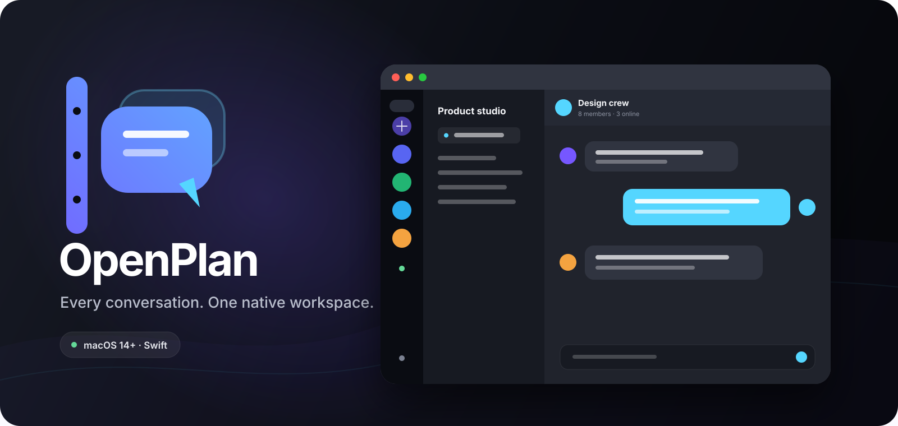
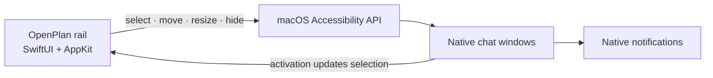

<p align="center">
  
</p>

<h1 align="center">OpenPlan</h1>

<p align="center">
  A fast, native macOS command rail for every work chat you already use.
  <br>
  No web wrappers. No copied credentials. No compromised notifications.
</p>

<p align="center">
  
  
  
</p>

---

## One rail. Every conversation.

OpenPlan turns Slack, Discord, Buzz, WhatsApp, Telegram, Teams, and any other
installed macOS chat app into one coherent workspace. Pick an app from the
floating rail and its real native window appears beside it—already positioned,
already sized, and fully signed in.

The app you leave is hidden, not quit. Notifications, deep links, calls,
updates, menus, and native reply actions keep working exactly as their
developers intended.

### Built for the way chat actually works

- **Native all the way down** — OpenPlan controls installed macOS apps rather
  than loading their websites.
- **One shared geometry** — resize one workspace window and every app inherits
  that size as you switch.
- **60 fps rail movement** — chat windows track the rail in real time using
  coalesced position-only updates, with one final layout pass on release.
- **Workspace controls** — minimize every managed window together or refit the
  active surface from the macOS-style title strip.
- **A real settings surface** — Settings occupies the same workspace slot,
  follows the rail, and participates in shared sizing.
- **Bring anything** — add any installed `.app`, use its real icon, reorder the
  rail, disable it, or delete it.
- **Notification-safe** — every chat app remains responsible for its own
  notifications and actions.

## How it works

macOS does not provide a public API for embedding another process's `NSWindow`
inside a SwiftUI hierarchy. OpenPlan uses the supported Accessibility API to
coordinate separate native windows into one visual workspace.



OpenPlan only arranges windows. It does not read messages, intercept
notifications, access account credentials, or modify the chat application
bundles.

## Quick start

### Requirements

- macOS 14 Sonoma or newer
- Xcode 15 or newer
- Accessibility permission for OpenPlan

### Install the latest release

1. Download the latest macOS disk image from
   [GitHub Releases](https://github.com/imetandy/openplan/releases/latest).
2. Open the `.dmg` and drag OpenPlan into Applications.
3. Launch OpenPlan and grant Accessibility access.

Release builds are currently arm64, ad-hoc signed, and not notarized. macOS may
ask you to confirm the first launch in **System Settings → Privacy & Security**.

### Build the app

```sh
git clone https://github.com/imetandy/openplan.git
cd openplan
./scripts/bundle.sh
open build/OpenPlan.app
```

The bundle script produces an arm64, ad-hoc signed application at
`build/OpenPlan.app`.

### Grant window access

1. Launch OpenPlan.
2. Open **System Settings → Privacy & Security → Accessibility**.
3. Enable OpenPlan.
4. Return to the rail and select a chat app.

This permission allows OpenPlan to position and resize windows. It does not
grant access to their content.

## The workspace

| Action | Behavior |
| --- | --- |
| Select an app | Launches or reveals it beside the rail and hides the previous app |
| Select the active app | Hides it; select it again to reveal it |
| Drag the rail | Moves the visible workspace window alongside it at roughly 60 fps |
| Resize a workspace window | Stores that size for every app you switch to |
| Yellow title control | Minimizes the rail and every managed app |
| Green title control | Refits the current chat or Settings window |
| Open Settings | Replaces the visible chat with the app editor |
| Activate a chat externally | Updates the selected rail item automatically |

## Add and arrange apps

Open **Settings** from the bottom of the rail:

1. Drag a row handle to reorder it.
2. Choose **Add chat app** to create another slot.
3. Choose an installed `.app`; OpenPlan picks up its name, bundle identifier,
   and application icon.
4. Toggle apps on or off, rename them, or delete any row.
5. Save to update the rail immediately.

The built-in configuration includes:

| App | Bundle identifier |
| --- | --- |
| Slack | `com.tinyspeck.slackmacgap` |
| Discord | `com.hnc.Discord` |
| Buzz | `xyz.block.buzz.app` |
| WhatsApp | `net.whatsapp.WhatsApp` |
| Telegram | `ru.keepcoder.Telegram` |

## Keyboard

| Action | Shortcut |
| --- | --- |
| Select rail apps 1–9 | <kbd>⌘1</kbd> … <kbd>⌘9</kbd> |
| Previous / next app | <kbd>⇧⌘[</kbd> / <kbd>⇧⌘]</kbd> |
| Fit the active surface | <kbd>⇧⌘F</kbd> |
| Reveal the selected app | <kbd>⇧⌘O</kbd> |
| Open Settings | <kbd>⌘,</kbd> |

## Why the Dock icons remain

AppKit exposes another application's activation policy as read-only. Only the
application itself can adopt accessory mode and omit its Dock icon. OpenPlan
does not patch signed apps, inject code, or use private window-server APIs.

That constraint preserves code signatures, automatic updates, menus, deep
links, notification actions, and macOS security boundaries.

## Development

Run directly with Swift Package Manager:

```sh
swift run OpenPlan
```

Validate a release bundle:

```sh
./scripts/bundle.sh release
codesign --verify --deep --strict --verbose=2 build/OpenPlan.app
```

Build the distributable disk image and checksum:

```sh
brew install create-dmg librsvg
./scripts/package_release.sh 0.1.0
```

The codebase is intentionally small:

```text
Sources/OpenPlan/
├── Core/       # persistence and cross-process window coordination
├── Models/     # configurable chat services
└── UI/         # rail, Settings, permissions, and brand components
```

## Platform notes

- The rail and chat app remain separate process-owned windows.
- Mission Control still identifies each chat app independently.
- Apps with custom minimum sizes may not exactly match the requested geometry.
- Public distribution requires Developer ID signing, hardened runtime, and
  notarization.
- Rebuilding an ad-hoc development bundle can prompt macOS to request
  Accessibility permission again.

<p align="center">
  
  <br>
  <sub>Native conversations, arranged.</sub>
</p>
